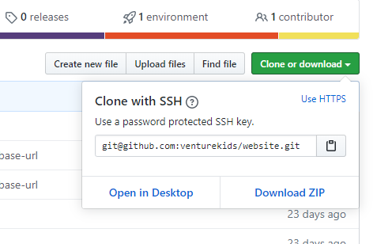
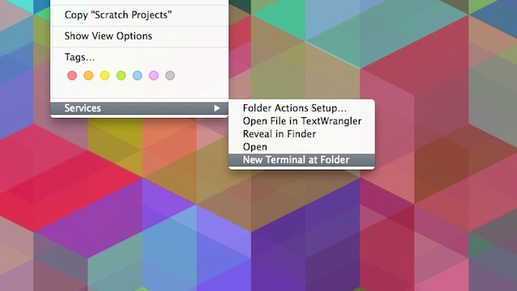
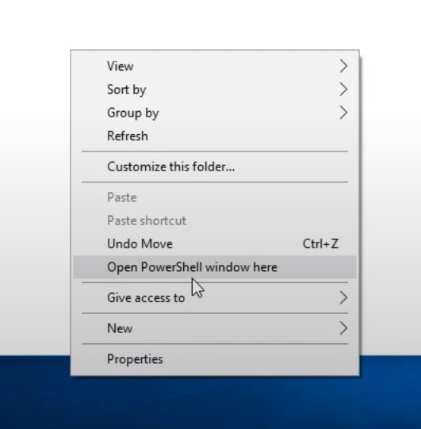
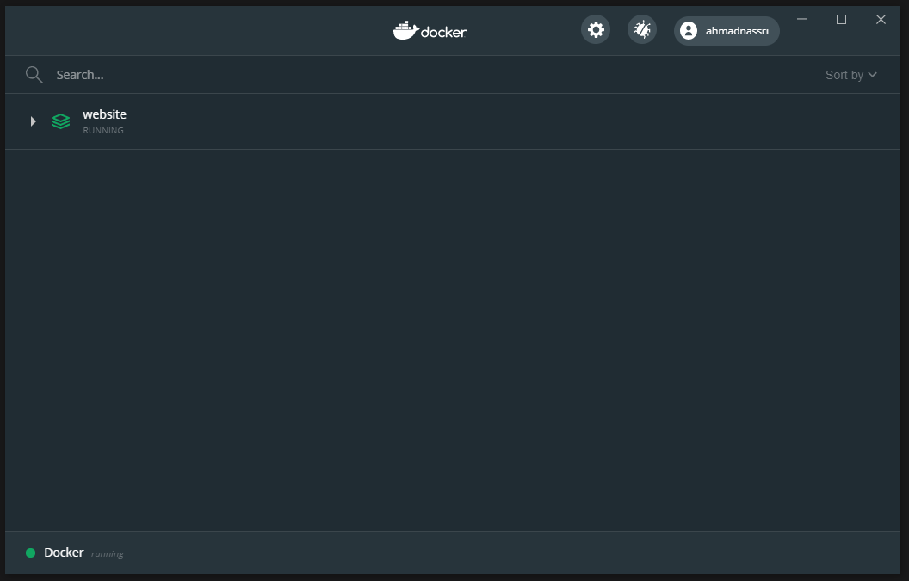
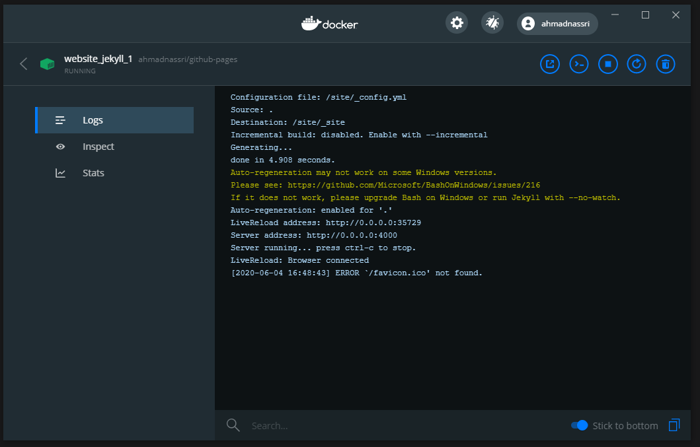
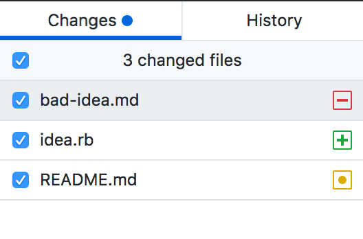
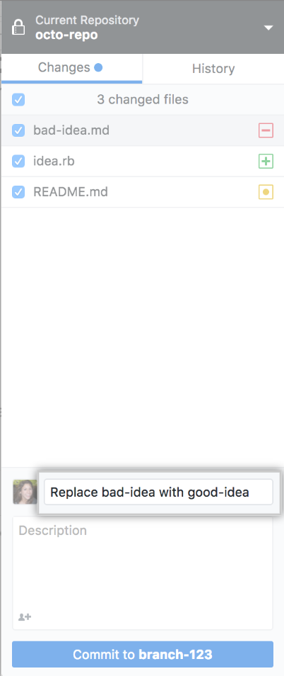

# Development Instructions

## Prerequisites

- [Docker Desktop](https://www.docker.com/products/docker-desktop)
- [GitHub Desktop](https://desktop.github.com/)

> ⚠ _**NOTE:** When the installation of Docker Desktop is completed, Docker Desktop launches the onboarding tutorial. You can skip this step entirely._

#### Reference Docs _(Optional)_
- [GitHub Desktop - Getting Started](https://help.github.com/en/desktop/getting-started-with-github-desktop)
- Docker Desktop - Getting Started
  - [Mac](https://docs.docker.com/docker-for-mac/)
  - [Windows](https://docs.docker.com/docker-for-windows/)

## Steps

### 1. Clone the repository

When setting up for the first time, you'll need to clone the repository onto your machine. This only needs to be done once.

1. Sign in to GitHub and GitHub Desktop before you start to clone.
1. On GitHub, navigate to the main page of the repository.
1. Under your repository name, click **Clone or download**.
1. Click **Open in Desktop** to clone the repository and open it in GitHub Desktop.  
  
1. Click **Choose...** and, using Finder/Windows Explorer, navigate to a local path where you want to clone the repository.
1. Click Clone.

> ℹ _**OPTIONAL:** Read the [detailed guide](https://help.github.com/en/desktop/contributing-to-projects/making-changes-in-a-branch)_

### 2. Open Terminal

1. Ensure that Docker Desktop is running on your machine
1. Navigate to the folder where you cloned the repository using Finder / Windows Explorer and open the path in terminal:
  
#### Mac

1. Head into **System Preferences** and select `Keyboard` > `Shortcuts` > `Services`. 
1. Find _"New Terminal at Folder"_ in the settings and click the box.  
  
1. Now, when you're in Finder, just right-click a folder and you're shown the open to open Terminal.

#### Windows:
1. Hold `Shift` and right-click
1. click "Open PowerShell window here"  
  

### 3. Start Server

In Terminal / PowerShell, type the following and hit enter:

```bash
docker-compose up -d
```

This will start the server, and keep it running.

You can check the status of the server _(as well as access the log)_ using Docker Desktop:




### 4. Start Editing

- In your browser of choice, navigate to http://localhost:4000
- You can now start editing the source code using any editor of your choice and changes will be automatically refreshed live

### 5. Commit Changes

Once you're satisfied with the changes you made, you want to "commit" those changes to the repository, then "push" them to GitHub

1. As you make changes to files in your text editor and save them locally, you will also see the changes in GitHub Desktop.
1. Click the checkbox next to each changed file you want to commit:
   

> ℹ _**OPTIONAL:** Read the [detailed guide](https://help.github.com/en/desktop/contributing-to-projects/committing-and-reviewing-changes-to-your-project)

### 4. Write a commit message and push your changes

1. Once you're satisfied with the changes you've chosen to include in your commit, write your commit message and push your changes. If you've collaborated on a commit, you can also attribute a commit to more than one author.  
   
1. Under the Description field, click **Commit to _master_**.
1. Click **Push origin** or **Force push origin** to push your changes to GitHub
   
1. Allow for a few minutes while GitHub builds and deploys the changes.
1. You can check the status under the [Deployments](https://github.com/venturekids/website/deployments) section of the GitHub repository
